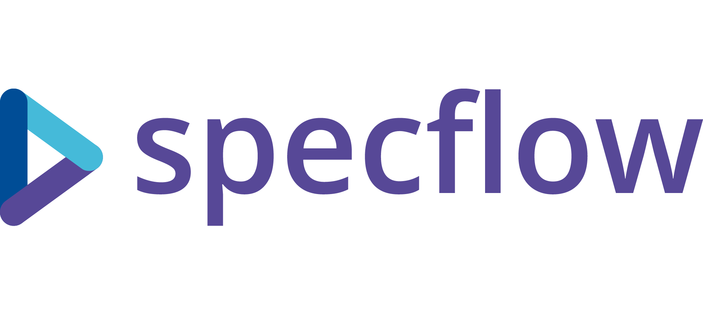

# Jeux API

Ce repository contient l'implémentation des *API* pour les jeux et les spécifications *SpecFlow* avec Gherkin.

   

## 📚 Jeux disponibles dans cette librairie :

| Jeu                            | API              | SpecFlow       |
|--------------------------------|------------------|------------------------------|
| 🕹️ TicTacToe (morpion)         | TicTacToeApi ⌛ (en cours 🔨) | SpecFlowIHMTicTacToeApi ✅        |
| 🎾 Partie de tennis (deux sets gagnants) | JeuxTennisApi ✅   | SpecFlowJeuxTennisApi ✅        |
| 🎯 Fléchettes                  | FlechettesApi ⌛ (en cours 🔨) | SpecFlowFlechettesApi ✅          |
| 🔍 Mastermind                  | MastermindApi ✅   | SpecFlowMastermindApi ✅          |

## 🚀 Dotnet utilisé : 6.0


#### 🎁 [Bonus]
Pour la démonstration de l'application, nous avons décidé d'utiliser une application web Single-page Application (VueJs + ASP.NET) utilisant JeuxTennisApi. En effet, dans l'équipe, nous avons des développeurs utilisant Linux et nous n'avons pas la possibilité d'utiliser certaines fonctionnalités de dotnet simple (comme WPF).

##### 🌐 Interface Homme-Machine (IHM) de Jeux Tennis
L'IHM de Jeux Tennis se trouve dans le projet **Jeux-IHM** et sa spécification est **SpecFlowIHMJeuxTennis** qui utilise Selenium.

##### 🛠️ Instructions d'installation
1. Clonez le répository
```bash
git clone https://github.com/ChineDmitri/Behavior-Driven-Development_Jeux
cd Behavior-Driven-Development_Jeux
```
2. Démarrage de l'IHM dans une invite de commande :
```bash
cd Jeux-IHM
dotnet build
dotnet run
```

##### ▶️ Pour lancer les tests :
1. Exécution de la spécification dans une autre invite de commande *(le test lance automatiquement Jeux-IHM et termine le processus à la fin)* :
```bash
cd SpecFlowIHMJeuxTennis 
dotnet build 
dotnet test SpecFlowIHMJeuxTennis.csproj
```

